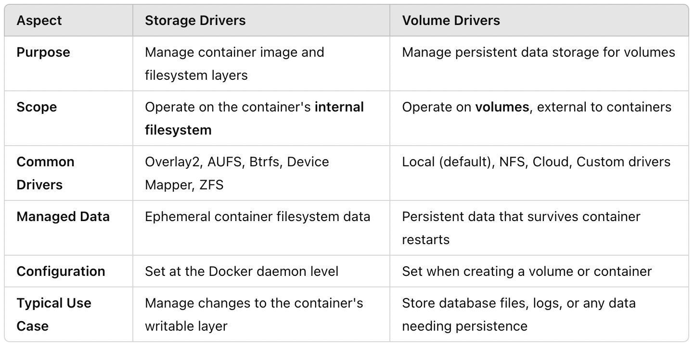
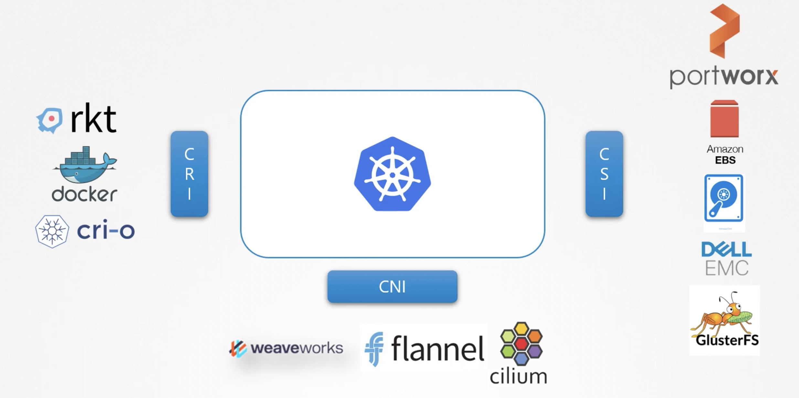

# Storage

## Storage in Docker

Docker uses a layered storage architecture. Each instruction in `Dockerfile` corresponds to one image layer in the container image. All these image layers are read-only. When a container is created from an image, then on top of the read-only image layers there is a read-write container layer. When the container is removed the data in the container layer is gone. To persist data you need a Docker volume:

```
docker volume create data_volume                    # Create a volume in /var/lib/docker/volumes/data_volume
docker run -v data_volume:/var/lib/mysql mysql      # Persist the database in volume
```

When a Docker volume is not explicitly created and you use this volume in `docker run`, then Docker will automaticaly create the volume in `var/lib/docker/volumes`. This is called **Docker volume mounting**.

If you already have data, not in `/var/lib/docker/volumes`, but located somewhere else in the filesystem of the host system, then you can use **Docker bind mounting**:

```
docker run -v /data/mysql:/var/lib/mysql mysql
```

NEW WAY OF VOLUME MOUNTING: `docker run --mount type=volume,source=data_volume,target=/var/lib/mysql mysql`
NEW WAY OF BIND MOUNTING: `docker run --mount type=bind,source=/data/mysql,target=/var/lib/mysql mysql`

**Storage Drivers** enable/manage the Docker layered storage architecture.
**Volume Drivers** enable/manage Docker volumes



For example: Docker container mounting a AWS EBS:

```
docker run \
    --name mysql \
    --volume-driver rexray/ebs \
    --mount src=ebs-vol,target=/var/lib/mysql \
    mysql
```

- **CRI**: Container Runtime Interface
- **CNI**: Container Network Interface
- **CSI**: Container Storage Interface

Kubernetes uses these interface and therefore any technology can be used for Kubernetes when it implements one of these interfaces.



## Kubernetes Volumes

In Kubernetes, you can directly define a volume inside the Pod specification without needing to use a PersistentVolume or PersistentVolumeClaim. This is useful for cases where the storage does not need to be persistent beyond the lifecycle of the Pod or container. One common type of directly defined volume is an emptyDir volume.

```
apiVersion: v1
kind: Pod
metadata:
  name: shared-storage-pod
spec:
  containers:
    - name: container1
      image: busybox
      command: [ "sh", "-c", "echo Hello from Container 1 > /data/message; sleep 3600" ]
      volumeMounts:
        - mountPath: /data
          name: shared-storage
    - name: container2
      image: busybox
      command: [ "sh", "-c", "cat /data/message; sleep 3600" ]
      volumeMounts:
        - mountPath: /data
          name: shared-storage
  volumes:
    - name: shared-storage
      emptyDir: {}

```

**Common Use Cases for Direct Volume Definitions:**

- Shared Data Between Containers: Using volumes like emptyDir to share data between multiple containers in the same Pod.
- Temporary Data Storage: For use cases where the data is temporary and doesn’t need to persist beyond the Pod lifecycle.
- Log Collection: To share log files between containers or sidecars (such as a logging agent).

**Other Volume Types That Can Be Defined Directly in a Pod:**

- **hostPath**: Maps a directory or file from the host machine to the Pod.
- **configMap**: Injects configuration data into the container from a ConfigMap.
- **secret**: Injects sensitive information (e.g., passwords) into the container.
- **downwardAPI**: Exposes metadata about the Pod, such as labels or annotations, to the container.
- **...**: Multiple other options such as AWS EBS, Azure Disk and many more

A disadvantage of directly defining volumes in a Pod is that the developer needs to have technical storage knowledge, which a developer probably will not have. This complexity can be abstracted away with `PersistenVolumes` and `PersistenVolumeClaims`. Cluster administrators define a bunch of `PersistentVolumes` and developers define `PersistentVolumeClaims` for their Pods. When the requirements of a `PersistentVolumeClaim` (such as for example accessMode (ROM, RWO, RWM) or storage capacity) match the attributes of a `PersistentVolume`, the `PersistentVolume` is bound to the `PersistenVolumeClaim`. When a Pod is deleted and its `PersistententVolumeClaim` is deleted then the state of the `PersistentVolume` depends on its attribute `persistentVolumeReclaimPolicy` (Delete, Recycle, Retain(default)).

## Storage Class

`PersistentVolumes` are static provisioned, meaning that a cluster administrator has to create them. With `StorageClass` a `PersistenVolume` is automatically created or dynamically provisioned when a `PersistentVolumeClaim` has been created. The `PersistentVolumeClaim` definition defines what `StorageClass` must create a `PersistenVolume` by the `storageClassName` attribute.
